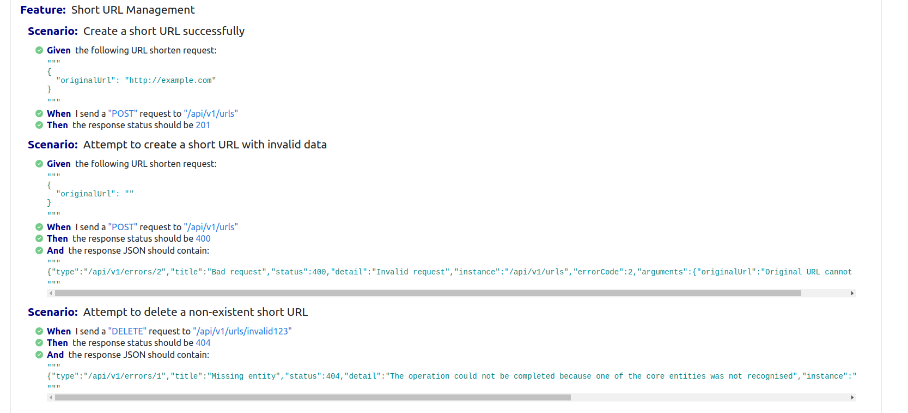
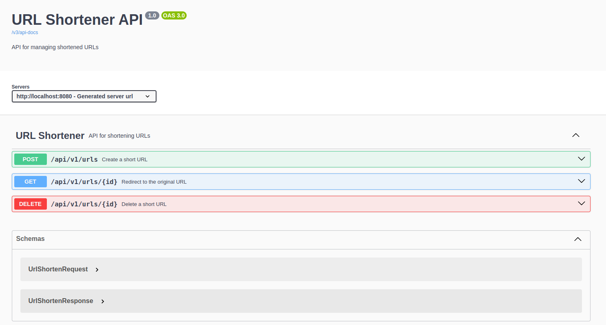

# URL Shortener Service

This project is a URL Shortener RESTful service built using Spring Boot. The service allows you to shorten URLs with optional TTL (Time-to-Live) functionality.

## Features

- Shorten any URL to a unique alphanumeric ID.
- Option to provide custom IDs for shortened URLs.
- Support for specifying a TTL for URLs. After the TTL expires, the URLs are deleted.
- Redirect functionality using HTTP GET on the short URL ID.
- RESTful interface with meaningful error messages.
- OpenAPI documentation

## Technologies Used

- **Spring Boot**: Core framework for building the REST service.
- **Spring Data JPA**: ORM for database interaction.
- **H2 Database**: In-memory relational database - (because it's a home task assignment – I'd never dare use this in production 😅)
- **Liquibase**: Database version control.
- **SLF4J**: Logging framework.
- **Jakarta**: Validation framework
- **Cucumber**: BDD testing framework



## Database Schema

The database schema is managed using Liquibase. The main table `short_url` contains the following columns:

- `id` (varchar(10)): Unique alphanumeric ID for the shortened URL (Primary Key).
- `original_url` (text): The original long URL.
- `expiration_time` (timestamp): Optional expiration time for the URL.

## How to Run

1. Clone the repository.
2. Build the project using Maven:
   ```bash
   ./mvnw clean install
   ```
3. Run the application:
   ```bash
   ./mvnw spring-boot:run
   ```
4. The application will be available at `http://localhost:8080`.
5. The Swagger UI is available at http://localhost:8080/swagger-ui/index.html. Use this interface to explore and test the API endpoints interactively.

